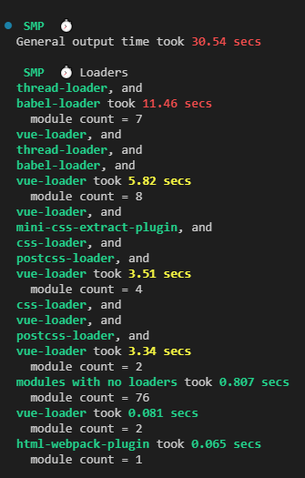
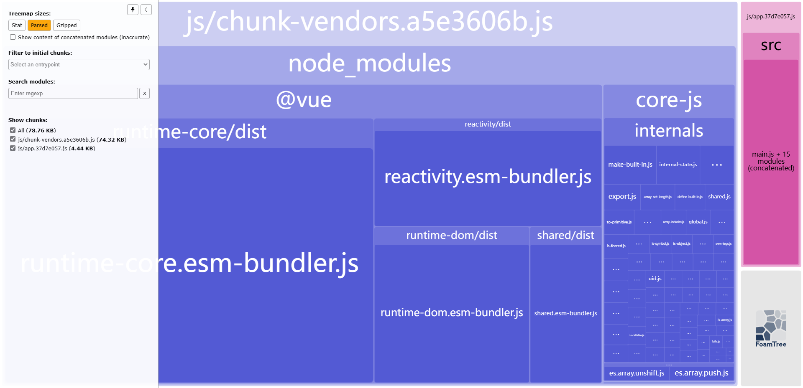
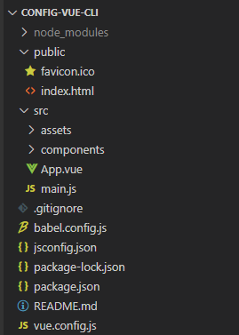
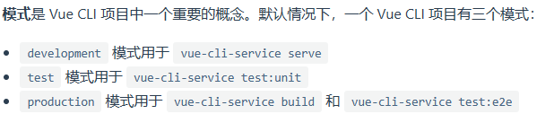
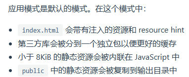

# @vue/cli 5.x的配置实践

## 一、汇总

### 1、@vue/cli5.x做了哪些工作？

- 引入Babel转换ES代码，使用`@vue/cli-plugin-babel/preset`预设，默认将`useBuildIns: 'usage'`传递给`babel/preset-env`，这样它会根据代码中出现的语言特性自动按需引入polyfill
- Vue/Babel/TypeScript编译默认开启cache-loader缓存在`node-modules/.cache`
- 多核CPU的机器上默认为Babel/TypeScript转译开启`thread-loader`，即多线程
- 默认安装yorkie，让我们在`package.json`的`gitHooks`字段中指定Git hook，通常配合lint-staged使用(pre: 需安装并配置)
- 默认使用`html-webpack-plugin`处理`public/index.html`模板，自动注入资源链接(preload/prefetch、manifest、js、css)
- 默认使用` @vue/preload-webpack-plugin`对link资源preload、prefetch
  - preload: vue cli会为所有初始化渲染需要的资源文件在link标签上自动注入preload
  - prefetch: vue cli会为所有作为async chunk生成的js文件(通过动态import()按需code splitting的产物)自动注入prefetch
- 默认小于8KIB的图片资源会被内联(base64)，以减小HTTP请求的数量，同时也会使得文件略微变大(图片转base64后占据空间更大)
- 静态资源的处理
  - 在JS、CSS、*.vue文件中通过相对路径被引用，这类引用会被webpack处理
    - 如果URL 是一个绝对路径 (例如 `/images/foo.png`)，它将会被保留不变
    - 如果 URL 以 `.` 开头，它会作为一个相对模块请求被解释且基于你的文件系统中的目录结构进行解析
    - 如果 URL 以 `~` 开头，其后的任何内容都会作为一个模块请求被解析。这意味着你甚至可以引用 Node 模块中的资源
    - 如果 URL 以 `@` 开头，它也会作为一个模块请求被解析。它的用处在于 Vue CLI 默认会设置一个指向 `<projectRoot>/src` 的别名 `@`。**(仅作用于模版中)**
  - public文件夹
    - 任何放置在 `public` 文件夹的静态资源都会被简单的复制，而不经过 webpack。你需要通过绝对路径来引用它们
- 默认支持PostCSS、CSS Modules和包含Sass、Less、Stylus在内的预处理器
  - PostCSS: 可以通过`.postcssrc`文件或`vue.config.js`中的`css.loaderOptions.postcss`配置
  - CSS Modules：scoped技术，给css限定作用域
  - CSS及预处理器相关，可以通过`vue.config.js`中的`css.loaderOptions`配置
- 配置webpack
  - configureWebpack（Object | Function）
    - 会被`webpack-merge`合并入最终的webpack配置，通常用于修改一些基础配置、引入插件等
    - 一些基础值不能直接修改，如你应该修改 `vue.config.js` 中的 `outputDir` 选项而不是修改 `output.path`；你应该修改 `vue.config.js` 中的 `publicPath` 选项而不是修改 `output.publicPath`
  - chainWebpack（Function）
    - vue cli内部的webpack配置是通过`webapck-chain`维护的
    - 通常用于增加、删除、修改、替换loader，修改plugin选项等
- 模式和环境变量
  - 模式
    - `development`模式用于`vue-cli-service serve`
    - `test`模式用于`vue-cli-service test:unit`
    - `production`模式用于`vue-cli-service build`和`vue-cli-service test:e2e`
  - 环境变量
    - 始终可用，且可以再public/index.html中以HTML插值的方式使用
      - VUE_APP_*：可以在vue.config.js中被赋值
      - NODE_ENV：`development|test|production`，取决于模式
      - BASE_URL：等于vue.config.js中的publicPath
    - 仅vue.config.js中可用
      - 除以上三种外
    - 注意
      - 环境变量不能直接在template中以process.env.*使用，要先赋值给变量再使用(template不认识process)
- 默认使用`mini-css-extract-plugin`提取css成单独文件
- 默认使用`css-minimizer-webpack-plugin`压缩css代码(webpack在生产模式下自动压缩js、html)
- 代码热更新
- 自动清除上次构建生成的内容
- ...

### 2、@vue/cli 5.x还可以做哪些优化？

#### 分析工具

##### 分析编译时长`speed-measure-webpack-plugin`

- 功能：测量构建速度，输出各个模板编译时长

- 配置：

  ```js
  npm install speed-measure-webpack-plugin --save-dev
  ```

  ```js
  const { defineConfig } = require('@vue/cli-service');
  const SpeedMeasurePlugin = require('speed-measure-webpack-plugin');
  module.exports = defineConfig({
    ...,
    configureWebpack: (config) => {
        ...
        config.plugins.push(
          new SpeedMeasurePlugin(),
        );
      },
  });
  ```

- 结果

  

##### 分析模块大小`webpack-bundle-analyzer`

- 功能：可视化展示构建后各个包的大小

- 配置：

  ```js
  npm install webpack-bundle-analyzer --save-dev
  ```

  ```js
  const { defineConfig } = require('@vue/cli-service');
  const BundleAnalyzerPlugin = require('webpack-bundle-analyzer').BundleAnalyzerPlugin;
  module.exports = defineConfig({
    ...,
    configureWebpack: (config) => {
        ...
        config.plugins.push(
        	new BundleAnalyzerPlugin()
        );
      },
  });
  ```

- 结果

  

#### 构建优化

##### 多线程优化`thread-loader`

- vue cli默认为Babel/TypeScript转译开启，不需要额外配置
- 注：thread-loader的启用开销为只600ms左右，最好只针对耗时操作启用。

- 缓存优化

  - webpack缓存方式介绍

    - `cache`配置项(webpack5.x)

      ```js
      const { defineConfig } = require('@vue/cli-service');
      module.exports = defineConfig({
        ...,
        configureWebpack: (config) => {
      	// 缓存生成的 webpack 模块和 chunk，来改善构建速度
          config.cache = {
          	type: 'filesystem',
          	allowCollectingMemory: true
          };
        }
      });
      ```

    - 下面几种缓存方式都有首次启动时的开销，即它们会让 "冷启动" 时间会更长，但是二次启动能够节省很多时间

      - `cache-loader`
      - `hard-source-webpack-plugin`（vue/cli使用的是webpack5，不可用）
      - `babel-loader`的`cacheDirectory`选项
      - vue cli默认为vue、babel、js、eslint、splitChunks启用了缓存

##### 构建进度条

- ProgressPlugin

  - 配置

    ```js
    const { ProgressPlugin } = require('webpack');
    module.exports = defineConfig({
        configureWebpack: config => {
          	const plugins = [
              new ProgressPlugin({
                activeModules: true, // 默认false，显示活动模块计数和一个活动模块正在进行消息。
                entries: true, // 默认true，显示正在进行的条目计数消息。
                modules: true, // 默认true，显示正在进行的模块计数消息。
                modulesCount: 5000, // 默认5000，开始时的最小模块数。PS:modules启用属性时生效。
                profile: false, // 默认false，告诉ProgressPlugin为进度步骤收集配置文件数据。
                dependencies: true, // 默认true，显示正在进行的依赖项计数消息。
                dependenciesCount: 10000 // 默认10000，开始时的最小依赖项计数。PS:dependencies启用属性时生效
              })
            ];
            return {
              plugins
            };
        }
    });
    ```

  - webpackbar

#### 生产优化

##### 减少js代码体积

- 删除console、debugger、注释

  ```js
  const { defineConfig } = require('@vue/cli-service');
  module.exports = defineConfig({
  	...,
  	chainWebpack: config => {
      	if (process.env.NODE_ENV === 'production') { // 生产
              // 删除console、debugger、注释
              const terser = config.optimization.minimizer('terser');
              terser.tap(args => {
                const { terserOptions } = args[0];
                Object.assign(
                  terserOptions,
                  {
                    compress: {
                      ...terserOptions.compress,
                      drop_console: true,
                      drop_debugger: true
                    },
                    format: {
                      comments: /@license/i
                    }
                  }
                );
                return args;
              });
  		}
      }
  });
  ```

##### 压缩图片资源

- `image-minimizer-webpack-plugin`

  - 配置

    ```js
    npm install image-minimizer-webpack-plugin imagemin @squoosh/lib --save-dev
    npm install imagemin-gifsicle imagemin-jpegtran imagemin-optipng imagemin-svgo --save-dev
    ```

    ```js
    const { defineConfig } = require('@vue/cli-service');
    const ImageMinimizerPlugin = require("image-minimizer-webpack-plugin");
    module.exports = defineConfig({
        ...,
        chainWebpack： config => {
        	if (process.env.NODE_ENV === 'production') { // 生产
                const optimization = config.optimization;
                // 压缩图片
                const imageMinizer = optimization.minimizer('image-minizer');
                imageMinizer.use(ImageMinimizerPlugin, [{
                  minimizer: {
                    implementation: ImageMinimizerPlugin.imageminMinify,
                    options: {
                      // Lossless optimization with custom option
                      // Feel free to experiment with options for better result for you
                      plugins: [
                        ["gifsicle", { interlaced: true }],
                        ["jpegtran", { progressive: true }],
                        ["optipng", { optimizationLevel: 5 }],
                        // Svgo configuration here https://github.com/svg/svgo#configuration
                        [
                          "svgo",
                          {
                            plugins: [
                              {
                                name: "preset-default",
                                params: {
                                  overrides: {
                                    removeViewBox: false,
                                    addAttributesToSVGElement: {
                                      params: {
                                        attributes: [
                                          { xmlns: "http://www.w3.org/2000/svg" }
                                        ]
                                      }
                                    }
                                  }
                                }
                              }
                            ]
                          }
                        ]
                      ]
                    }
                  }
                }]);
    		}
    	}
    });
    ```

  - 注：webpack5官网配置有误，上面是该依赖的git仓库提供的配置

##### `dll`动态链接库

- 自webpack4起已过时，vue-cli也已移除dll，同时也不推荐使用。因为webpack4有着比dll更好的打包性能。在webpack4推荐使用`hard-source-webpack-plugin`，然而这个在webpack5中也过时了，使用cache配置项爆杀上述两个。
- vue issue [RFC: beta.10, Upgrading to webpack 4 + vue-loader 15 · Issue #1205 · vuejs/vue-cli (github.com)](https://github.com/vuejs/vue-cli/issues/1205)

##### 启用gzip压缩文件

- 配置

  `vue.config.js`开启gzip静态压缩

  ```js
  const CompressionPlugin = require("compression-webpack-plugin");
  module.exports = defineConfig({
      configureWebpack: config => {
          const plugins = [];
        	if (process.env.NODE_ENV === 'production') { // 生产
            plugins.push(
              // new SpeedMeasurePlugin(),
              // new BundleAnalyzerPlugin(),
              new CompressionPlugin({
                test: /\.(js|css|json|html)(\?.*)?$/i,
                filename: '[path].gz[query]', // 压缩后的文件名
                algorithm: 'gzip',
                threshold: 10240, // 仅处理大于此大小的资产（以字节为单位）
                minRatio: 0.8, // 仅压缩比该比率更好的资产（minRatio = Compressed Size / Original Size）
                deleteOriginalAssets: false // 是否删除原始文件
              })
            );
          }
          return {
            plugins
          };
      }
  });
  ```

  `nginx.conf`文件配置

  ```nginx
  server{
  	...
  	# 开启Gzip压缩：若没有找到.gz，会动态压缩，因此建议前端打包成.gz文件
      gzip on;
      gzip_min_length 1k;
      gzip_buffers 4 16k;
      gzip_comp_level 5;
      gzip_types text/plain application/javascript application/x-javascript text/css application/xml text/javascript application/x-httpd-php image/jpeg image/gif image/png;
      gzip_http_version 1.1;
      gzip_vary on;
      gzip_disable "MSIE [1-6]\.";
  }
  ```

##### 样式风格检查stylelint


##  二、详细介绍

### 1、基础内容

​	1）CLI 

​	CLI (@vue/cli) 是一个全局安装的 npm 包，提供了终端里的 vue 命令。例：vue create；vue ui

​	2）CLI 服务

​	CLI 服务 (`@vue/cli-service`) 是一个开发环境依赖。它是一个 npm 包，局部安装在每个 `@vue/cli` 创建的项目中。CLI 服务是构建于 [webpack](http://webpack.js.org/) 和 [webpack-dev-server](https://github.com/webpack/webpack-dev-server) 之上的。它包含了：

- 加载其它 CLI 插件的核心服务；

- 一个针对绝大部分应用优化过的内部的 webpack 配置；

- 项目内部的 `vue-cli-service` 命令，提供 `serve`、`build` 和 `inspect` 命令

  3）CLI 插件

  CLI 插件是向你的 Vue 项目提供可选功能的 npm 包。Vue CLI 插件的名字以 `@vue/cli-plugin-` (内建插件) 或 `vue-cli-plugin-` (社区插件) 开头。

### 2、初始配置

### 1）目录



2）package.json

```json
{
  "name": "config-vue-cli",
  "version": "0.1.0",
  "private": true,
  "scripts": {
    "serve": "vue-cli-service serve",
    "build": "vue-cli-service build",
    "lint": "vue-cli-service lint"
  },
  "dependencies": {
    "core-js": "^3.8.3",
    "vue": "^3.2.13"
  },
  "devDependencies": {
    "@babel/core": "^7.12.16",
    "@babel/eslint-parser": "^7.12.16",
    "@vue/cli-plugin-babel": "~5.0.0",
    "@vue/cli-plugin-eslint": "~5.0.0",
    "@vue/cli-service": "~5.0.0",
    "eslint": "^7.32.0",
    "eslint-plugin-vue": "^8.0.3"
  },
  "eslintConfig": {
    "root": true,
    "env": {
      "node": true
    },
    "extends": [
      "plugin:vue/vue3-essential",
      "eslint:recommended"
    ],
    "parserOptions": {
      "parser": "@babel/eslint-parser"
    },
    "rules": {}
  },
  "browserslist": [
    "> 1%",
    "last 2 versions",
    "not dead",
    "not ie 11"
  ]
}

```

3）vue.config.js

```
const { defineConfig } = require('@vue/cli-service')
module.exports = defineConfig({
  transpileDependencies: true
})
```

4）Babel.config.js

```
module.exports = {
  presets: [
    '@vue/cli-plugin-babel/preset'
  ]
}
```

5）jsconfig.json

```
{
  "compilerOptions": {
    "target": "es5",
    "module": "esnext",
    "baseUrl": "./",
    "moduleResolution": "node",
    "paths": {
      "@/*": [
        "src/*"
      ]
    },
    "lib": [
      "esnext",
      "dom",
      "dom.iterable",
      "scripthost"
    ]
  }
}
```

### 3、默认配置

1）默认使用babel、eslint

2）`cache-loader` 会默认为 Vue/Babel/TypeScript 编译开启。文件会缓存在 `node_modules/.cache [CLI 服务 | Vue CLI (vuejs.org)](https://cli.vuejs.org/zh/guide/cli-service.html#%E7%BC%93%E5%AD%98%E5%92%8C%E5%B9%B6%E8%A1%8C%E5%A4%84%E7%90%86)

3）`thread-loader` 会在多核 CPU 的机器上为 Babel/TypeScript 转译开启

4）在安装之后，`@vue/cli-service` 也会安装 [yorkie](https://github.com/yyx990803/yorkie)，它会让你在 `package.json` 的 `gitHooks` 字段中方便地指定 Git hook  [CLI 服务 | Vue CLI (vuejs.org)](https://cli.vuejs.org/zh/guide/cli-service.html#git-hook)

5）默认将[`useBuiltIns: 'usage'`](https://new.babeljs.io/docs/en/next/babel-preset-env.html#usebuiltins-usage) 传递给 `@babel/preset-env`，这样它会根据源代码中出现的语言特性自动检测需要的 polyfill。当使用 Vue CLI 来[构建一个库或是 Web Component](https://cli.vuejs.org/zh/guide/build-targets.html) 时，推荐给 `@vue/babel-preset-app` 传入 `useBuiltIns: false` 选项。这能够确保你的库或是组件不包含不必要的 polyfills。通常来说，打包 polyfills 应当是最终使用你的库的应用的责任。[浏览器兼容性 | Vue CLI (vuejs.org)](https://cli.vuejs.org/zh/guide/browser-compatibility.html#usebuiltins-usage)

6）默认引入 html-webpack-plugin。`public/index.html` 文件是一个会被 [html-webpack-plugin](https://github.com/jantimon/html-webpack-plugin) 处理的模板。在构建过程中，资源链接会被自动注入。另外，Vue CLI 也会自动注入 resource hint (`preload/prefetch`、manifest 和图标链接 (当用到 PWA 插件时) 以及构建过程中处理的 JavaScript 和 CSS 文件的资源链接。[HTML 和静态资源 | Vue CLI (vuejs.org)](https://cli.vuejs.org/zh/guide/html-and-static-assets.html)

​	preload：一个 Vue CLI 应用会为所有初始化渲染需要的文件自动使用 preload

​	prefetch：一个 Vue CLI 应用会为所有作为 async chunk 生成的 JavaScript 文件 ([通过动态 `import()` 按需 code splitting](https://webpack.js.org/guides/code-splitting/#dynamic-imports) 的产物，即写路由时动态import组件) 自动使用prefetch

7）默认小于8KiB的图片资源会被内联，以减小HTTP请求的数量。（即Base64，带来的问题时文件变大）[HTML 和静态资源 | Vue CLI (vuejs.org)](https://cli.vuejs.org/zh/guide/html-and-static-assets.html#%E4%BB%8E%E7%9B%B8%E5%AF%B9%E8%B7%AF%E5%BE%84%E5%AF%BC%E5%85%A5)

8）静态资源的处理

​	在js、css、template中通过相对路径引用，会被webpack处理

​	在public目录下(public目录下的资源只能通过绝对路径引用)，会被直接拷贝，不会经过webpack处理

​		[HTML 和静态资源 | Vue CLI (vuejs.org)](https://cli.vuejs.org/zh/guide/html-and-static-assets.html#public-%E6%96%87%E4%BB%B6%E5%A4%B9)

​	[HTML 和静态资源 | Vue CLI (vuejs.org)](https://cli.vuejs.org/zh/guide/html-and-static-assets.html#%E5%A4%84%E7%90%86%E9%9D%99%E6%80%81%E8%B5%84%E6%BA%90)

9）Vue CLI 项目天生支持 [PostCSS](http://postcss.org/)、[CSS Modules](https://github.com/css-modules/css-modules) 和包含 [Sass](https://sass-lang.com/)、[Less](http://lesscss.org/)、[Stylus](http://stylus-lang.com/) 在内的预处理器。

​	Vue CLI 内部使用了 PostCSS。可以通过 `.postcssrc`文件或`vue.config.js` 中的 					`css.loaderOptions.postcss` 配置 [postcss-loader](https://github.com/postcss/postcss-loader)

​	CSS Modules通常不需要使用，与scoped技术都是为了给css限定作用域

​	使用Sass、Less、Stylus预处理器需要安装loader

​	[CSS 相关 | Vue CLI (vuejs.org)](https://cli.vuejs.org/zh/guide/css.html#css-%E7%9B%B8%E5%85%B3)

10）配置webpack

​	configureWebpack(简单配置)

​		会被 [webpack-merge](https://github.com/survivejs/webpack-merge) 合并入最终的 webpack 配置

​		通常用于引入一些plugin

​		有些 webpack 选项是基于 `vue.config.js` 中的值设置的，所以不能直接修改。如output.path和output.publicPath（应该修改vue.config.js中的outputDir和publicPath）

​	chainWebpack(链式配置)

​		Vue CLI 内部的 webpack 配置是通过 [webpack-chain](https://github.com/mozilla-neutrino/webpack-chain) 维护的

​		通常用于增加、修改、替换、删除loader；修改插件选项等

​		[Webpack-chain 从入门到深入 - 掘金 (juejin.cn)](https://juejin.cn/post/6947851867422621733)

11）模式和环境变量

​	当运行 `vue-cli-service` 命令时，所有的环境变量都从对应的[环境文件](https://cli.vuejs.org/zh/guide/mode-and-env.html#%E7%8E%AF%E5%A2%83%E5%8F%98%E9%87%8F)中载入。共有development、test、production三种模式。[模式和环境变量 | Vue CLI (vuejs.org)](https://cli.vuejs.org/zh/guide/mode-and-env.html#%E6%A8%A1%E5%BC%8F)



​	在代码中始终可用的环境变量

​		VUE_APP_开头的变量：可以在vue.config.js中被赋值

​		NODE_ENV：`"development"`、`"production"` 或 `"test"`，取决于模式。

​		BASE_URL：与vue.config.js中的publicPath相符。

​	注1：除以上三种变量在代码中可用，其余自定义的环境变量只在vue.config.js中能取到值，在别处为undefined

​	注2：环境变量不能在template中直接以process.env.*引用，必须赋值给data中的变量才能使用（插值语法不认识process）。

​	注3：只有以上三种环境变量可以在 `public/index.html` 中以 [HTML 插值](https://cli.vuejs.org/zh/guide/html-and-static-assets.html#%E6%8F%92%E5%80%BC)中介绍的方式使用。

12）构建目标

​	应用：

​		

​	库

​	web components组件

​	[构建目标 | Vue CLI (vuejs.org)](https://cli.vuejs.org/zh/guide/build-targets.html#%E6%9E%84%E5%BB%BA%E7%9B%AE%E6%A0%87)

13）history路由模式const Router = new VueRouter({mode: 'history'}...)

​	使用history模式，必须配置nginx，将没有匹配到静态文件的请求回退到index.html，否则访问页面会404。[部署 | Vue CLI (vuejs.org)](https://cli.vuejs.org/zh/guide/deployment.html#%E4%BD%BF%E7%94%A8-history-pushstate-%E7%9A%84%E8%B7%AF%E7%94%B1)

​	nginx配置见[不同的历史模式 | Vue Router (vuejs.org)](https://router.vuejs.org/zh/guide/essentials/history-mode.html#nginx)

14）Vue CLI 应用都使用 `@vue/babel-preset-app`，它包含了 `babel-preset-env`、JSX 支持以及为最小化包体积优化过的配置


### 4、优化

1）现代模式 vue-cli-service build --modern [浏览器兼容性 | Vue CLI (vuejs.org)](https://cli.vuejs.org/zh/guide/browser-compatibility.html#%E7%8E%B0%E4%BB%A3%E6%A8%A1%E5%BC%8F)

2）图片资源是否转base64由8KIB的限制调整为4KIB，缩小文件体积[HTML 和静态资源 | Vue CLI (vuejs.org)](https://cli.vuejs.org/zh/guide/html-and-static-assets.html#%E4%BB%8E%E7%9B%B8%E5%AF%B9%E8%B7%AF%E5%BE%84%E5%AF%BC%E5%85%A5)

3）审查webpack配置

​	[webpack 相关 | Vue CLI (vuejs.org)](https://cli.vuejs.org/zh/guide/webpack.html?#%E5%AE%A1%E6%9F%A5%E9%A1%B9%E7%9B%AE%E7%9A%84-webpack-%E9%85%8D%E7%BD%AE)

​	[CLI 服务 | Vue CLI (vuejs.org)](https://cli.vuejs.org/zh/guide/cli-service.html#vue-cli-service-inspect)

### 5、其他

1）Runtime + Compiler和Runtime-only的区别

[Vue教程(四十)Runtime + Compiler和Runtime-only的区别_vue build runtime__否极泰来_的博客-CSDN博客](https://blog.csdn.net/yuan_xw/article/details/119699623)

2）
